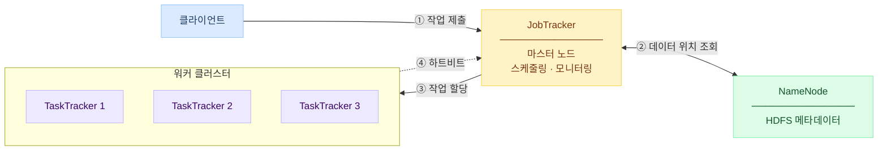

# Hadoop과 MapReduce, 대규모 데이터를 분산 처리하는 방법

> 수천 대의 서버가 하나처럼 움직이는 분산 처리 프레임워크

---

## 들어가며

데이터가 수 테라바이트, 페타바이트 단위로 커지면 단일 서버로는 처리가 불가능해진다. 스토리지가 부족하고, 연산 속도가 따라가지 못하며, I/O 대역폭이 병목이 된다.

Hadoop은 이 문제를 "비싼 서버 한 대"가 아닌 **"저렴한 서버 수천 대"**로 해결한다. 단순히 서버를 추가하는 것만으로 연산 능력, 저장 용량, I/O 대역폭이 선형으로 확장된다.

이 글은 Hadoop의 핵심 개념인 MapReduce 프로그래밍 모델과 분산 처리 메커니즘을 정리한 것이다.

---

## 1. MapReduce: 분산 처리를 위한 프로그래밍 모델

MapReduce는 **대규모 데이터셋을 처리하고 생성하기 위한 프로그래밍 모델**이다. Lisp 등 함수형 언어의 `map`과 `reduce` 원시 기능에서 영감을 받았다.

핵심 아이디어는 두 가지다.

- **데이터와 연산을 여러 호스트에 분할**하여 병렬 처리
- **데이터 근처에서 연산을 실행**하여 네트워크 비용 최소화

MapReduce가 강력한 이유는 **병렬 처리, 장애 허용, 데이터 분배, 로드 밸런싱**과 같은 복잡한 세부 사항을 프레임워크가 숨겨준다는 점이다. 개발자는 "무엇을 처리할 것인가"만 정의하면 된다.

---

## 2. MapReduce 프로그래밍 모델

MapReduce는 **key/value 쌍**을 기본 단위로 동작한다. 입력도 key/value, 출력도 key/value다.

### 전체 흐름

```
입력 (key/value 쌍)
  ↓
Map 함수 (중간 key/value 생성)
  ↓
Shuffling (동일한 키를 가진 값 그룹화)
  ↓
Reduce 함수 (값 병합 → 최종 결과)
  ↓
출력 (key/value 쌍)
```

### Map 함수

사용자가 작성하며, 입력 key/value 쌍을 받아 중간 key/value 쌍을 생성한다.

```
입력: (문서ID, 문서내용)
출력: (단어, 1), (단어, 1), (단어, 1), ...
```

### Shuffling

MapReduce 런타임이 자동으로 처리한다. **동일한 중간 키를 가진 모든 값을 그룹화**하여 Reduce 함수로 전달한다.

```
(apple, [1, 1, 1]) → Reducer로 전달
(banana, [1, 1])   → Reducer로 전달
```

### Reduce 함수

사용자가 작성하며, 중간 키와 그 키에 속한 값들을 받아 병합한다.

```
입력: (apple, [1, 1, 1])
출력: (apple, 3)
```

### WordCount 예시

가장 고전적인 예시인 단어 개수 세기는 이렇게 동작한다.

```
[Map 단계]
"hello world hello" → (hello, 1), (world, 1), (hello, 1)

[Shuffle 단계]
(hello, [1, 1]), (world, [1])

[Reduce 단계]
(hello, 2), (world, 1)
```

---

## 3. 분산 실행 구조

실제 클러스터에서는 Map과 Reduce 작업이 **여러 머신에 분산**되어 병렬로 실행된다.

```
입력 데이터 (전체)
  ↓ 자동 분할
[M개의 입력 분할]
  ↓ 병렬 실행
[Map 작업 × M]
  ↓ 중간 키 공간 파티셔닝
[R개의 조각]
  ↓ 병렬 실행
[Reduce 작업 × R]
  ↓
최종 출력
```

- **M**: Map 작업의 수 (입력 데이터 분할 수에 비례)
- **R**: Reduce 작업의 수 (파티셔닝 함수로 결정)

각 입력 분할은 독립적으로 처리되므로 M개의 Map 작업이 완전히 병렬로 실행된다.

---

## 4. Shuffle and Sort: MapReduce의 핵심

Shuffle and Sort는 MapReduce에서 가장 복잡한 단계다. Map 출력을 Reducer에게 전달하는 과정이다.

### Map 측 처리

```
Map 함수 실행
  ↓
메모리 내 순환 버퍼에 출력 저장
  ↓ (버퍼가 임계값에 도달하면)
디스크에 "spill" (임시 파일)
  ↓
spill 파일들을 단일 파티션 파일로 병합
각 파티션 내에서 정렬
  ↓ (병합 중)
Combiner 실행 (네트워크 전송량 감소)
```

**Combiner**는 로컬 Reduce라고 볼 수 있다. Reducer로 데이터를 보내기 전에 같은 머신에서 미리 집계하여 네트워크 전송량을 줄인다.

### Reduce 측 처리

```
Map 출력을 Reducer 머신으로 복사 (네트워크 전송)
  ↓
메모리와 디스크에서 여러 번 병합
  ↓ (마지막 병합 결과)
Reducer로 직접 전달
```

---

## 5. 장애 허용 (Fault Tolerance)

분산 시스템에서 일부 머신이 죽는 것은 예외가 아니라 **당연한 일**이다. MapReduce는 이를 자동으로 처리한다.

### Worker 장애 처리

- 마스터가 **주기적으로 모든 워커에 핑(ping)**을 보내 생존 여부 확인
- 응답이 없으면 해당 워커를 실패로 표시하고, 작업을 다른 워커에 **재할당**
- 실패한 Map 작업: **재실행** (출력이 로컬 디스크에 있으므로 접근 불가)
- 완료된 Reduce 작업: **재실행 불필요** (출력이 글로벌 파일 시스템에 저장)

Map과 Reduce의 재시도 전략이 다른 이유는 출력 위치의 차이다. Map 출력은 로컬 디스크에만 있으므로 해당 머신이 죽으면 다시 계산해야 한다. Reduce 출력은 HDFS 같은 분산 파일 시스템에 있으므로 머신이 죽어도 접근 가능하다.

---

## 6. 데이터 지역성 최적화 (Data Locality)

네트워크 대역폭은 제한된 자원이다. 데이터를 네트워크로 전송하는 것보다 **연산을 데이터 근처로 가져가는** 것이 훨씬 효율적이다.

마스터는 Map 작업을 스케줄링할 때 다음 우선순위로 머신을 선택한다.

```
1순위: 입력 데이터의 복사본이 있는 머신 (Same Node)
  ↓ 불가능하면
2순위: 데이터 복사본과 같은 랙에 있는 머신 (Same Rack)
  ↓ 불가능하면
3순위: 임의의 머신 (Off-rack)
```

HDFS는 기본적으로 데이터를 3개의 복사본으로 유지하므로, 대부분의 경우 1순위 또는 2순위 머신에서 실행할 수 있다.

---

## 7. Hadoop = MapReduce + HDFS

Hadoop은 두 핵심 컴포넌트로 구성된다.

| 컴포넌트 | 역할 |
|---------|-----|
| **MapReduce** | 분산 연산 프레임워크 |
| **HDFS** (Hadoop Distributed File System) | 분산 파일 시스템 |

HDFS는 대용량 파일을 **블록 단위로 분할**하여 여러 노드에 분산 저장한다. MapReduce는 이 블록 위치 정보를 활용해 데이터 지역성을 최적화한다.

---

## 8. Hadoop MapReduce v1 아키텍처: JobTracker와 TaskTracker

Hadoop v1(1.x)의 클러스터 구조는 마스터-슬레이브 패턴이다.



### JobTracker

클러스터 전체의 **작업 스케줄링과 모니터링**을 담당하는 마스터 노드다.

작업 처리 흐름:
1. 클라이언트가 JobTracker에 작업 제출
2. JobTracker가 NameNode와 통신해 데이터 위치 확인
3. 데이터와 가까운 TaskTracker 노드를 찾아 작업 할당
4. TaskTracker 노드 상태 지속 모니터링

**단점**: JobTracker는 **단일 장애 지점(SPOF)**이다. JobTracker가 죽으면 클러스터의 모든 실행 중인 작업이 중단된다.

### TaskTracker

실제 Map/Reduce/Shuffle 작업을 수행하는 **워커 노드**다.

- 각 TaskTracker는 고정된 슬롯 수를 가짐 (수용 가능한 작업 수)
- 작업마다 별도의 JVM 프로세스를 생성 → 프로세스 실패가 TaskTracker 자체에 영향 없음
- 주기적으로 **하트비트 메시지**를 JobTracker에 전송 (생존 확인 + 가용 슬롯 수 보고)

---

## 9. MapReduce의 실제 가치

Google의 Large-Scale Indexing 사례를 보면 MapReduce의 실용적 가치가 명확하다.

- C++ 3,800줄 → MapReduce 사용 시 **700줄**로 축소
- 장애 처리, 분산, 병렬 처리가 **자동으로 관리**됨
- 기계 장애, 느린 기계, 네트워크 문제 등이 자동 처리되어 운영 부담 감소

복잡한 분산 시스템의 세부사항을 숨기고, 개발자가 **비즈니스 로직에만 집중**할 수 있게 한다는 점이 MapReduce의 핵심 가치다.

---

## 마치며

MapReduce는 "연산을 데이터 근처로" 라는 단순한 아이디어를 정교하게 구현한 프레임워크다.

- **Map**: 데이터를 키/값으로 변환
- **Shuffle**: 같은 키를 가진 데이터를 한곳으로 모음
- **Reduce**: 모인 데이터를 집계

이 세 단계가 수천 대의 서버에서 병렬로, 장애에 강하게, 네트워크 효율적으로 실행된다.

Hadoop v1의 JobTracker 단일 장애 지점 문제는 이후 **YARN**의 등장으로 해결된다. JobTracker의 역할을 ResourceManager(자원 관리)와 ApplicationMaster(작업 관리)로 분리하여 확장성과 안정성을 크게 개선했다. 이 부분은 다음 글에서 다룰 예정이다.

---

## 참고자료

- [MapReduce: Simplified Data Processing on Large Clusters - Google](https://research.google/pubs/mapreduce-simplified-data-processing-on-large-clusters/)
- [Apache Hadoop Documentation](https://hadoop.apache.org/docs/stable/)
- [HDFS Architecture Guide](https://hadoop.apache.org/docs/stable/hadoop-project-dist/hadoop-hdfs/HdfsDesign.html)
