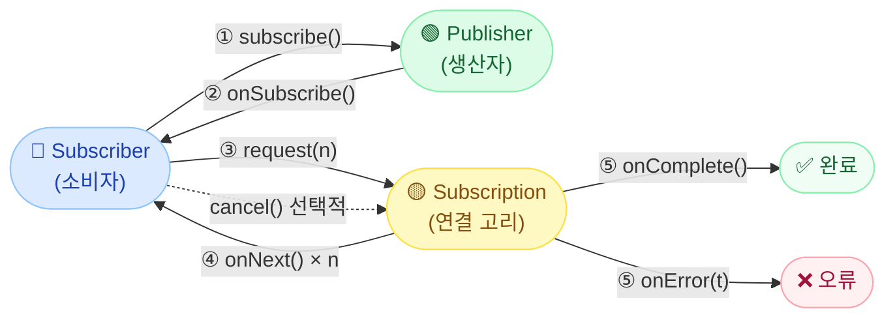
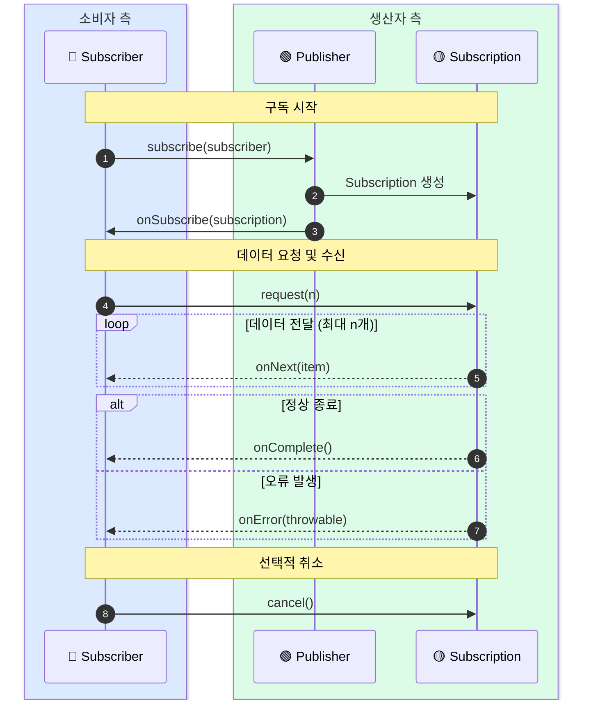
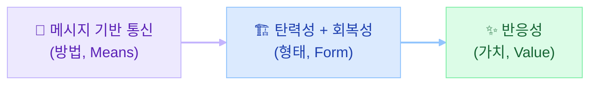

# [WebFlux 시리즈 1편] 리액티브 스트림즈와 Reactor, 표준과 구현체를 함께 이해하기

> WebFlux를 제대로 쓰려면 그 아래에 깔린 약속부터 봐야 한다.

## 0. 이 글을 쓰게 된 계기

WebFlux를 처음 공부하면서 가장 먼저 마주친 코드는 이런 모양이었다.

```java
public Mono<User> findById(Long id) {
    return userRepository.findById(id);
}
```

직관적으로 이해가 안 됐다. 왜 `User`를 그냥 반환하지 않고 `Mono<User>`로 감싸서 반환하는 걸까?
`Mono`가 뭔지는 알겠는데, 왜 이 설계가 필요한 건지 납득이 안 됐다.

그러다 더 낯선 말을 만났다.

> "subscribe()를 호출하기 전까지는 아무것도 실행되지 않는다."

처음에는 이게 무슨 말인지 몰랐다. 메서드를 호출했는데 실행이 안 된다고?

결국 `Mono`와 `Flux`가 왜 이렇게 동작하는지를 이해하려면,
그 아래에 깔린 표준 사양인 **리액티브 스트림즈(Reactive Streams)** 부터 봐야 했다.

이 글은 그 학습 과정을 정리한 것이다.

**이 글에서 다루는 것:**
- 리액티브 프로그래밍이 왜 필요한가
- 리액티브 스트림즈라는 표준이 어떻게 동작하는가
- Reactor(`Mono`, `Flux`)가 그 표준을 어떻게 구현했는가

이 글은 **WebFlux 학습 시리즈 1편**이다. 이후 편에서는 스케줄러, Context, 에러 처리를 다룬다.

---

## 1. 왜 리액티브 프로그래밍이 필요한가

### 스레드 기반 동기 방식의 한계

전통적인 Spring MVC는 요청 하나당 스레드 하나를 할당한다.

```
[동기 방식]

요청 → 스레드 점유 → DB 조회 (블로킹, 대기 중) → 응답 반환 → 스레드 해방
         ↑
    I/O 대기 동안 스레드가 아무것도 안 하면서 자원을 점유하고 있다
```

DB 조회, 외부 API 호출, 파일 I/O 같은 작업은 결과를 기다리는 동안 스레드가 멈춘다.
요청이 100개면 스레드도 100개가 필요하다. 트래픽이 몰리면 스레드 풀이 고갈되고 응답이 지연된다.

### 비동기/논블로킹 방식의 접근

리액티브 방식은 이 구조를 뒤집는다.

```
[리액티브 방식]

요청 → 이벤트 등록 → 스레드 해방 → (다른 요청 처리) → I/O 완료 이벤트 → 응답
                           ↑
              스레드가 대기하지 않고 다른 일을 한다
```

스레드가 I/O 결과를 기다리는 대신, 결과가 준비되면 알림을 받는 구조다.
적은 수의 스레드로 훨씬 많은 동시 요청을 처리할 수 있다.

이 방식을 **비동기 논블로킹(Asynchronous Non-blocking)** 이라고 한다.
그리고 이것을 체계적으로 다루기 위해 등장한 표준이 **리액티브 스트림즈**다.

---

## 2. 리액티브 스트림즈: 표준이 왜 필요했나

비동기 프로그래밍을 위한 라이브러리는 이미 여럿 있었다. RxJava, Akka Streams 등.
문제는 **각자 다른 API와 규약**을 가지고 있었다는 것이다.

라이브러리끼리 호환이 안 됐고, 개발자는 어떤 라이브러리를 쓰느냐에 따라 완전히 다른 코드를 작성해야 했다.

그래서 2013년, **공통 표준인 리액티브 스트림즈 사양**이 만들어졌다.

핵심 원칙은 하나다.

> **"인터페이스와 규약만 정의한다. 구현은 각자 알아서."**

리액티브 스트림즈는 딱 4개의 인터페이스만 정의한다.

```java
// 데이터를 발행하는 주체
public interface Publisher<T> {
    void subscribe(Subscriber<? super T> subscriber);
}

// 데이터를 소비하는 주체
public interface Subscriber<T> {
    void onSubscribe(Subscription subscription);
    void onNext(T item);
    void onError(Throwable throwable);
    void onComplete();
}

// Publisher ↔ Subscriber 간 연결 고리
public interface Subscription {
    void request(long n);
    void cancel();
}

// Publisher이자 Subscriber인 중간 처리자
public interface Processor<T, R> extends Subscriber<T>, Publisher<R> {
}
```

이 4개의 인터페이스가 리액티브 스트림즈의 전부다.
구현은 Reactor, RxJava 등이 각자 담당한다.

---

## 3. 네 인터페이스가 상호작용하는 방법

인터페이스를 정의했으면, 이들이 어떤 순서로 대화하는지 규약도 정해야 한다.

리액티브 스트림즈의 상호작용 흐름은 이렇다.

**개요: 세 주체의 관계**



**상세 흐름: 단계별 상호작용**



단계별로 풀어보면:

1. **`subscribe()`**: Subscriber가 Publisher에게 구독을 요청한다.
2. **`onSubscribe()`**: Publisher가 Subscription 객체를 생성해 Subscriber에게 전달한다. 이 시점부터 공식적인 연결이 성립한다.
3. **`request(n)`**: Subscriber가 Subscription을 통해 "n개의 데이터를 주세요"라고 요청한다.
4. **`onNext()`**: Publisher가 요청받은 만큼 데이터를 하나씩 전달한다.
5. **`onComplete()` / `onError()`**: 스트림이 정상 종료되거나 오류가 발생하면 알린다.
6. **`cancel()`**: Subscriber가 더 이상 데이터를 받고 싶지 않을 때 구독을 취소한다.

---

## 4. 백프레셔: request(n)이 단순한 요청이 아닌 이유

`request(n)`이 이 프로토콜의 핵심이다. 단순히 "데이터 주세요"가 아니다.

**소비자가 생산자의 속도를 제어하는 메커니즘**이다.

생산자(Publisher)가 초당 10,000건의 데이터를 생성할 수 있는데,
소비자(Subscriber)가 초당 100건밖에 처리하지 못한다고 생각해보자.

이를 음식점에 비유하면:
- **주방(Publisher)**: 초당 100개의 음식을 만들 수 있다.
- **서빙 직원(Subscriber)**: 한 번에 5개 접시만 들 수 있다.

서빙 직원이 준비됐을 때만 "5개 주세요"라고 요청하는 구조다.
주방이 독단적으로 접시를 계속 밀어내면 서빙 직원은 감당하지 못하고 음식이 바닥에 떨어진다.

이것이 **백프레셔(Backpressure)**다.

`request(n)`을 통해 소비자가 자신의 처리 능력에 맞게 데이터를 당겨오는(pull) 구조이기 때문에,
생산자가 소비자를 압도하는 상황을 시스템 레벨에서 방지할 수 있다.

기존 `Observer` 패턴이나 단순 콜백 방식에는 이 메커니즘이 없었다.
리액티브 스트림즈가 단순한 비동기 처리 API와 다른 핵심적인 이유가 여기 있다.

---

## 5. 리액티브 선언문: 이 기술이 지향하는 가치

리액티브 스트림즈는 기술 사양이다. 그렇다면 왜 이런 기술이 필요한가?
그 답이 **리액티브 선언문(Reactive Manifesto)** 에 있다.

리액티브 선언문은 리액티브 시스템이 갖춰야 할 특성을 **방법 → 형태 → 가치** 구조로 정의한다.



### 방법 (Means): 메시지 기반 통신

리액티브 시스템의 모든 상호작용은 **비동기 메시지**를 통해 이루어진다.

요청, 응답, 이벤트 전달, 상태 변경 — 이 모든 것이 메시지 단위로 오간다.
이를 위해 메시지 큐(Kafka, SQS 등)나 이벤트 루프 같은 구조를 활용한다.

### 형태 (Form): 탄력성과 회복성

메시지 기반 통신이 가능해지면, 두 가지 특성을 달성할 수 있다.

**탄력성(Elasticity)**
- 트래픽이 늘면 확장하고, 줄면 축소한다.
- 특정 노드에 부하가 집중되지 않도록 자동으로 분산한다.

**회복성(Resilience)**
- 한 컴포넌트가 장애를 일으켜도 전체 시스템이 무너지지 않는다.
- 장애는 발생한 곳에서 **격리(containment)** 되고, 시스템은 스스로 복구한다.

둘의 차이를 명확히 하면:
- **탄력성** = 부하 변화에 대응하는 능력 (성능의 관점)
- **회복성** = 장애 상황을 버티는 능력 (안정성의 관점)

### 가치 (Value): 반응성

방법과 형태가 갖춰지면, 최종적으로 사용자에게 **빠르고 일관된 응답**을 제공할 수 있다.

"성능이 좋다"는 것 이상이다. 장애 상황에서도 **예측 가능한 행동**을 보여주는 것이 반응성이다.

---

## 6. Reactor: 표준을 구현한 라이브러리

리액티브 스트림즈는 인터페이스와 규약만 정의한다. 실제로 쓰려면 구현체가 필요하다.

Spring WebFlux가 선택한 구현체가 **Reactor**다.

### 추상화 레벨의 전환

리액티브 스트림즈 시대에는 개발자가 `Publisher`, `Subscriber`, `Subscription`을 직접 구현해야 했다.

```java
// 리액티브 스트림즈를 직접 구현할 때 (이렇게까지 할 필요는 없다)
class MyPublisher implements Publisher<String> {
    @Override
    public void subscribe(Subscriber<? super String> subscriber) {
        // Subscription 구현, onNext 호출 로직, 백프레셔 처리...
    }
}
```

Reactor는 이 모든 것을 이미 구현해 두었다. 개발자는 `Mono`와 `Flux`를 **사용하는** 입장으로 전환된다.

### 퍼블리셔 계층 구조

| 레이어 | 타입 | 역할 |
|--------|------|------|
| 표준 사양 | `Publisher<T>` | 인터페이스와 규약만 정의 |
| Reactor 내부 | `CorePublisher<T>` | Reactor가 표준을 구현 |
| 개발자 사용 | `Mono<T>` / `Flux<T>` | 실제 코드에서 다루는 타입 |

개발자가 `Mono`와 `Flux`를 쓸 때, 내부적으로는 리액티브 스트림즈의 표준 프로토콜이 동작하고 있다.

---

## 7. Mono와 Flux: 언제 무엇을 쓰는가

### Mono – 0개 또는 1개

단일 결과 또는 완료 신호가 중요할 때 사용한다.

```java
// 결과가 하나거나 없을 때
Mono<User> findById(Long id);

// 반환값보다 완료 여부가 중요할 때
Mono<Void> deleteById(Long id);
```

| 메서드 | 설명 |
|--------|------|
| `Mono.just(T)` | 값 하나를 감싸서 Mono 생성 |
| `Mono.empty()` | 값 없이 완료 신호만 전송 |
| `Mono.error(Throwable)` | 오류 신호만 전송 |
| `map(Function)` | 값을 변환해 새로운 Mono 반환 |
| `flatMap(Function)` | 값을 다른 Publisher로 변환 |

### Flux – 0개 이상

목록, 스트림, 또는 무한 데이터 흐름에 사용한다.

```java
// 목록 조회
Flux<User> findAll();

// 무한 스트림도 가능
Flux<String> streamEvents();  // onComplete 없이 계속 발행 가능
```

| 메서드 | 설명 |
|--------|------|
| `Flux.just(T...)` | 여러 값을 순차 발행 |
| `Flux.fromIterable(Iterable)` | Iterable 요소를 순차 발행 |
| `Flux.range(start, count)` | 정수 범위를 순차 발행 |
| `filter(Predicate)` | 조건 만족하는 요소만 통과 |
| `concat(Publisher...)` | 여러 Publisher를 순서대로 합침 |

### 선택 기준 한 줄 정리

- **결과가 하나거나 없을 것이 확실하다** → `Mono`
- **여러 개이거나, 스트림 형태다** → `Flux`

---

## 8. Cold Publisher vs Hot Publisher

`Flux`를 이해할 때 중요한 구분이 하나 있다. **구독 시점이 데이터 수신에 영향을 주는가**.

### Cold Publisher – 구독할 때마다 처음부터

**VOD(주문형 비디오)**에 비유할 수 있다.
내가 재생을 시작하면(subscribe) 항상 처음부터 본다.
다른 사람이 같은 콘텐츠를 보든 말든 나와 무관하게 처음부터 스트림이 시작된다.

```java
Flux<String> coldFlux = Flux.just("A", "B", "C");  // 콜드 퍼블리셔

coldFlux.subscribe(s -> System.out.println("구독자1: " + s));
// 구독자1: A, 구독자1: B, 구독자1: C

coldFlux.subscribe(s -> System.out.println("구독자2: " + s));
// 구독자2: A, 구독자2: B, 구독자2: C  ← 처음부터 다시 시작
```

`Flux.just()`, `Flux.fromIterable()` 등 대부분의 Flux는 기본적으로 콜드 퍼블리셔다.

### Hot Publisher – 구독 시점부터 받는다

**라이브 방송**에 비유할 수 있다.
방송은 내가 접속하기 전부터 진행 중이고, 접속하면(subscribe) 그 시점 이후의 내용을 받는다.
이전에 방영된 내용은 받을 수 없다.

`Sinks`, `ConnectableFlux` 등이 핫 퍼블리셔를 구현하는 데 사용된다.
WebSocket, SSE 같은 실시간 스트림이 이 패턴을 따른다.

---

## 9. subscribe가 모든 것을 시작한다 – 지연 평가

이 개념이 처음에 가장 낯설었다.

Reactor에서 `Mono`나 `Flux`를 생성하고 연산자를 체이닝해도, **실제 실행은 `subscribe()`를 호출해야 시작된다.**

```java
// 이 시점에서는 아무것도 실행되지 않는다
Flux<String> flux = Flux.just("a", "b", "c")
    .map(String::toUpperCase)
    .filter(s -> !s.equals("B"));

System.out.println("아직 아무것도 실행 안 됨");

// subscribe() 호출 시점에 실제로 실행된다
flux.subscribe(s -> System.out.println("받은 데이터: " + s));
// 받은 데이터: A
// 받은 데이터: C
```

이를 **지연 평가(Lazy Evaluation)** 라고 한다.

왜 이렇게 설계했을까?

1. **실행 제어**: 구독하기 전까지는 스트림을 "선언"만 한 것이다. 언제, 어떻게 실행할지를 호출자가 결정한다.
2. **재사용 가능**: 같은 Flux를 여러 구독자가 다른 시점에 구독할 수 있다.
3. **백프레셔 연동**: `subscribe()` 내부에서 `request(n)` 프로토콜이 시작되므로, 소비자 주도의 흐름 제어가 자연스럽게 연결된다.

Spring WebFlux에서 컨트롤러 메서드가 `Mono`를 반환해도 Spring이 알아서 `subscribe()`를 호출해준다.
개발자가 직접 호출할 일은 많지 않지만, **이 원리를 모르면 "왜 실행이 안 되지?"** 라는 상황에 빠지기 쉽다.

---

## 마치며

처음에 `Mono<User>`가 왜 그냥 `User`가 아닌지 납득이 안 됐던 이유를 이제는 설명할 수 있다.

`Mono<User>`는 단순히 "나중에 올 수도 있는 User"가 아니다.
**리액티브 스트림즈 표준 프로토콜 위에서, 백프레셔와 지연 평가를 갖춘 데이터 스트림**이다.

`Publisher<T>` → `CorePublisher<T>` → `Mono<T>` 라는 계층을 따라,
우리가 쓰는 코드 아래에는 표준화된 규약이 동작하고 있다.

이 관점을 가지고 나면 이후 개념들이 훨씬 자연스럽게 연결된다.

- **왜 스케줄러(Scheduler)가 필요한가?** → 어느 스레드에서 subscribe 이후의 체인이 실행될지 제어하기 위해
- **왜 Context가 필요한가?** → 스레드가 바뀌어도 요청 단위 데이터를 전달하기 위해
- **왜 에러 처리가 별도 연산자로 존재하는가?** → `onError` 신호를 스트림 안에서 처리하기 위해

다음 글에서는 **[WebFlux 시리즈 2편] 스케줄러와 스레드 모델**을 다룬다.
"어느 스레드에서 코드가 실행되는가"를 직접 제어하는 방법과, 블로킹 코드가 왜 WebFlux에서 위험한지를 살펴본다.
