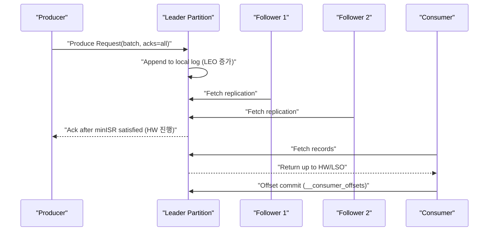

# Kafka 이해와 Spring 실전 가이드 (심화)

## 0. 이 문서의 목표
이 문서는 "Kafka를 써본 적은 있지만 왜 이렇게 동작하는지 모르겠다"는 상태를 넘어, **설계/운영/장애 대응까지 스스로 판단**할 수 있도록 만드는 학습 문서다. 단순 개념 소개가 아니라 다음을 목표로 한다.

- Kafka의 내부 동작(로그 저장, 복제, 오프셋 관리, 리밸런싱) 이해
- 실무에서 자주 터지는 문제(중복, 순서 깨짐, lag 급증, DLT 폭증) 원인 분해
- Spring Boot + Spring Kafka에서 실제로 쓰는 설정/코드 패턴 정리
- "Exactly Once"를 마케팅 문구가 아닌 구현 범위/한계 관점으로 이해

---

## 1. Kafka를 한 줄로 정의하면
Kafka는 "메시지를 전달하는 큐"라기보다 **분산 append-only 로그**다. 이 차이가 핵심이다.

- 큐 관점: 소비하면 사라진다.
- 로그 관점: 기록은 유지되고, 소비자는 자기 오프셋을 기준으로 읽는다.

즉 Kafka는 "데이터를 보내는 기술"이 아니라, **이벤트를 시간축으로 저장하고 여러 소비자가 독립적으로 재생(replay)하는 기술**이다.

---

## 2. 핵심 추상화와 설계 직관
### 2.1 Topic / Partition / Offset
- `Topic`: 이벤트 카테고리 (`order.created`)
- `Partition`: 병렬 처리 단위
- `Offset`: 파티션 내 단조 증가 위치

중요한 사실:
- **순서는 파티션 내부에서만 보장**된다.
- 컨슈머 그룹 내 동시성 상한은 "파티션 수"다.
- 파티션 수가 적으면 확장이 막히고, 너무 많으면 운영 비용(파일 핸들/메타데이터/리밸런스 비용)이 커진다.

### 2.2 Consumer Group
같은 `group.id`를 가진 컨슈머는 파티션을 나눠 갖는다.
- 같은 그룹: 분산 처리(로드 밸런싱)
- 다른 그룹: 독립 소비(팬아웃)

실무에서 가장 흔한 오해는 "컨슈머 인스턴스만 늘리면 빨라진다"는 생각이다. 파티션 수가 그대로면 남는 인스턴스는 유휴 상태가 된다.

---

## 3. 브로커 내부 동작: 왜 Kafka가 빠르고 강한가
### 3.1 로그 세그먼트 구조
파티션은 여러 로그 세그먼트 파일로 구성된다.
- 로그 파일(데이터)
- 오프셋 인덱스
- 시간 인덱스

이 구조 덕분에 Kafka는 큰 로그에서도 빠른 조회와 효율적인 보존(삭제/컴팩션)을 수행한다.

### 3.2 복제와 안정성: Leader/Follower, ISR
각 파티션은 리더 1개 + 팔로워 N개 복제본을 가진다.
- Producer/Consumer는 리더와 통신
- 팔로워는 리더를 fetch 하며 따라잡음
- ISR(In-Sync Replicas)은 충분히 동기화된 복제본 집합

`acks=all`과 `min.insync.replicas`를 함께 쓰면 내구성을 높일 수 있다. 예: RF=3, minISR=2이면 ISR 과반이 못 맞춰질 때 produce가 실패하므로 "조용한 유실"을 막는다.

### 3.3 LEO / HW / LSO
- `LEO`: 리더 로그 끝
- `HW(High Watermark)`: ISR에 복제 완료된 안전 경계
- `LSO(Last Stable Offset)`: 트랜잭션 커밋까지 반영된 경계

`read_committed` 소비자는 LSO 기준으로 읽기 때문에, 미완료/중단 트랜잭션 레코드를 보지 않는다.

### 3.4 Produce -> Replication -> Consume 흐름


---

## 4. Producer 심화: 설정 몇 개로 운명이 바뀐다
### 4.1 전송 파이프라인
Producer는 레코드를 바로 네트워크로 보내지 않는다.
1. RecordAccumulator에 배치로 모음
2. `linger.ms`, `batch.size` 조건으로 배치 구성
3. 압축(`compression.type`) 후 브로커 전송

배치를 키우면 처리량은 좋아지고 지연은 늘어난다. 지연/처리량 트레이드오프를 의도적으로 선택해야 한다.

### 4.2 멱등 프로듀서(Idempotent Producer)
`enable.idempotence=true`면 재시도 시 중복 기록 위험을 크게 줄일 수 있다. Kafka 공식 설정 문서에서 강조하는 핵심 제약은 아래와 같다.
- `acks=all`
- `retries > 0`
- `max.in.flight.requests.per.connection <= 5`

최근 문서 기준으로 idempotence는 기본 활성 조건을 충족하면 자동 활성화되는 동작이 있으므로, **사용 중인 Kafka 버전 문서를 반드시 확인**해야 한다.

### 4.3 순서 보장과 재시도의 함정
- 같은 키를 같은 파티션으로 보내면 파티션 내부 순서는 유지된다.
- 키를 랜덤으로 보내면 순서 요구사항을 만족할 수 없다.
- `max.in.flight`/재시도 설정을 잘못 잡으면 장애 시 순서가 체감상 깨지는 케이스가 생긴다.

---

## 5. Consumer 심화: poll loop와 리밸런스 이해가 핵심
### 5.1 poll 중심 모델
KafkaConsumer는 `poll()`을 중심으로 동작한다.
- `max.poll.interval.ms`를 넘기면 컨슈머가 죽은 것으로 판단
- `session.timeout.ms`, `heartbeat.interval.ms`는 그룹 생존 판정과 직결

CPU 바운드/외부 I/O 바운드 로직을 listener 안에서 오래 잡으면 리밸런스 폭탄이 시작된다.

### 5.2 오프셋 커밋 위치 = 전달 보장 수준
- 자동 커밋: 간편하지만 제어력이 약함
- 수동 커밋: 처리 성공 지점에서 커밋 가능

원칙:
- "비즈니스 처리 완료" 이후 커밋해야 at-least-once가 된다.
- 처리 전에 커밋하면 유실 위험이 커진다.

### 5.3 리밸런스 전략
실무에서 리밸런스는 장애가 아니라 "정상 이벤트"다. 문제는 **비용**이다.
- eager 리밸런스: 전원 정지 후 재배치(공백 큼)
- cooperative 계열: 점진 재배치(공백 완화)
- static membership(`group.instance.id`): 재시작/일시 네트워크 단절 시 불필요 리밸런스 감소

---

## 6. 전달 보장(Delivery Semantics) 제대로 이해하기
### 6.1 At-most-once / At-least-once / Exactly-once
- At-most-once: 유실 가능, 중복 적음
- At-least-once: 중복 가능, 유실 최소화(대부분의 기본 선택)
- Exactly-once: 범위를 엄격히 정의해야 의미가 있다

### 6.2 EOS의 실제 경계
Kafka + Spring에서 말하는 EOS는 보통 **read -> process -> write to Kafka** 경계를 의미한다.
외부 DB/외부 API까지 포함하면 아래가 추가로 필요하다.
- 멱등 키 기반 중복 제거
- outbox/inbox 패턴
- 재처리 가능 상태 모델

즉 "EOS 켰으니 끝"은 거의 항상 오해다.

---

## 7. 토픽/키/보존 정책 설계
### 7.1 토픽 분리 기준
토픽은 "개발 팀 기준"이 아니라 "데이터 계약/수명주기/보안 정책" 기준으로 나누는 것이 유지보수에 유리하다.

### 7.2 키 설계
키는 단순 분산용 해시가 아니라 **정합성 단위**다.
- 주문 단위 정합성이 중요: `orderId` key
- 사용자 단위 정합성이 중요: `userId` key

### 7.3 보존/컴팩션
- `cleanup.policy=delete`: 시간/용량 기준 삭제
- `cleanup.policy=compact`: 키 기준 최신 상태 유지
- tombstone은 "삭제 의도"를 전파하는 메커니즘이며 `delete.retention.ms` 이해가 필수

컴팩션 토픽은 "모든 이벤트 보관"이 아니라 "최신 상태 재구성"에 초점이 있다.

---

## 8. Spring Boot + Spring Kafka 실전 예시
아래 코드는 "실무 기본형"에 가깝다. (멱등 producer + 수동 ack + DLT)

### 8.1 의존성
```gradle
implementation 'org.springframework.boot:spring-boot-starter'
implementation 'org.springframework.kafka:spring-kafka'
testImplementation 'org.springframework.kafka:spring-kafka-test'
```

### 8.2 application.yml
```yaml
spring:
  kafka:
    bootstrap-servers: localhost:9092

    producer:
      key-serializer: org.apache.kafka.common.serialization.StringSerializer
      value-serializer: org.springframework.kafka.support.serializer.JsonSerializer
      acks: all
      retries: 10
      properties:
        enable.idempotence: true
        max.in.flight.requests.per.connection: 5
      # 트랜잭션 producer를 사용할 경우 활성화
      transaction-id-prefix: order-tx-

    consumer:
      group-id: order-consumer-v2
      enable-auto-commit: false
      auto-offset-reset: earliest
      key-deserializer: org.apache.kafka.common.serialization.StringDeserializer
      value-deserializer: org.springframework.kafka.support.serializer.JsonDeserializer
      properties:
        spring.json.trusted.packages: "*"
        isolation.level: read_committed

    listener:
      ack-mode: manual_immediate
      concurrency: 3
```

### 8.3 Producer
```java
@Service
@RequiredArgsConstructor
public class OrderEventProducer {

    private final KafkaTemplate<String, OrderCreatedEvent> kafkaTemplate;

    public void publish(OrderCreatedEvent event) {
        // key를 orderId로 고정해 파티션 내부 순서를 보장한다.
        kafkaTemplate.send("order.created", event.orderId(), event)
                .whenComplete((result, ex) -> {
                    if (ex != null) {
                        // 운영 코드에서는 로깅 + 메트릭 + 보상 로직 트리거
                    }
                });
    }
}
```

### 8.4 Consumer Container + 에러 핸들러 + DLT
```java
@Configuration
public class KafkaConsumerConfig {

    @Bean
    public ConcurrentKafkaListenerContainerFactory<String, OrderCreatedEvent> kafkaListenerContainerFactory(
            ConsumerFactory<String, OrderCreatedEvent> consumerFactory,
            KafkaTemplate<String, Object> kafkaTemplate) {

        var factory = new ConcurrentKafkaListenerContainerFactory<String, OrderCreatedEvent>();
        factory.setConsumerFactory(consumerFactory);

        // 재시도 후 DLT로 보낸다. (3회 시도: 최초 + 2회 재시도)
        var recoverer = new DeadLetterPublishingRecoverer(
                kafkaTemplate,
                (record, ex) -> new TopicPartition(record.topic() + ".dlt", record.partition())
        );

        var errorHandler = new DefaultErrorHandler(recoverer, new FixedBackOff(1000L, 2L));
        // 비즈니스 규칙 위반은 재시도해도 성공 가능성이 낮으므로 즉시 DLT 전송
        errorHandler.addNotRetryableExceptions(IllegalArgumentException.class);

        factory.setCommonErrorHandler(errorHandler);
        return factory;
    }
}
```

### 8.5 Listener (멱등 처리 + 수동 ack)
```java
@Component
@RequiredArgsConstructor
public class OrderEventListener {

    private final ProcessedEventRepository processedEventRepository;
    private final OrderApplicationService orderApplicationService;

    @KafkaListener(topics = "order.created", containerFactory = "kafkaListenerContainerFactory")
    public void listen(OrderCreatedEvent event,
                       @Header(KafkaHeaders.RECEIVED_KEY) String key,
                       Acknowledgment ack) {

        // 1) 멱등성 가드: 같은 eventId를 이미 처리했으면 skip
        if (processedEventRepository.existsByEventId(event.eventId())) {
            ack.acknowledge();
            return;
        }

        // 2) 비즈니스 처리
        orderApplicationService.handle(event);

        // 3) 처리 이력 기록
        processedEventRepository.save(new ProcessedEvent(event.eventId()));

        // 4) 마지막에 오프셋 커밋
        ack.acknowledge();
    }
}
```

### 8.6 `@RetryableTopic` 패턴 (비차단 재시도)
```java
@Component
public class PaymentEventListener {

    @RetryableTopic(
            attempts = "4",
            backoff = @Backoff(delay = 1000, multiplier = 2.0),
            dltTopicSuffix = ".dlt"
    )
    @KafkaListener(topics = "payment.approved")
    public void onMessage(PaymentApprovedEvent event) {
        // 외부 API 일시 장애 등 재시도 가능한 예외 발생 가능
    }

    @DltHandler
    public void onDlt(PaymentApprovedEvent event) {
        // 운영 알람/수동 보정 큐 적재
    }
}
```

주의:
- Spring Kafka 문서 기준으로 **비차단 재시도(`@RetryableTopic`)는 배치 리스너와 조합 제약**이 있다.
- 또한 컨테이너 트랜잭션과 재시도 전략 조합 시 의미가 달라지므로 문서 기준으로 조합을 선택해야 한다.

---

## 9. 트랜잭션과 DB 연동: 가장 많이 헷갈리는 지점
### 9.1 Spring Boot 자동 구성 포인트
Spring Boot 문서 기준:
- `spring.kafka.producer.transaction-id-prefix`를 설정하면 `KafkaTransactionManager`가 자동 구성된다.

### 9.2 Kafka + DB 동시 처리의 현실
"DB와 Kafka를 완전 원자적으로 한 번에 커밋"은 분산 트랜잭션 이슈로 복잡하다. 일반적으로는 아래 두 패턴을 쓴다.

1. **Transactional Outbox 패턴**
- 비즈니스 데이터 + outbox 레코드를 DB 트랜잭션으로 커밋
- 별도 퍼블리셔가 outbox를 Kafka로 발행
- 발행 성공 후 outbox 상태 업데이트

2. **Kafka 우선/DB 우선 보상 설계**
- Spring 트랜잭션 동기화로 순서를 제어하되
- 2차 커밋 실패에 대한 보상/재처리 로직을 반드시 둔다

---

## 10. 운영 지표와 장애 대응
### 10.1 최소 관측 지표
- Consumer Lag (group/topic/partition)
- Rebalance 횟수와 시간
- DLT 유입량 / 재처리 성공률
- Broker Under-replicated partitions
- Produce/Fetch request latency (P95/P99)

### 10.2 장애 시나리오별 빠른 점검
1. lag 급증
- 컨슈머 에러율 증가 여부
- 외부 의존성(DB/API) 지연
- 파티션 불균형(핫 키)
- 리밸런스 빈도

2. 중복 처리 증가
- 커밋 시점(처리 후 커밋인지)
- 멱등 키 저장소 상태(unique index 누락 여부)
- 재시도 정책 과도 설정

3. 순서 깨짐 체감
- 키 설계가 순서 단위를 반영했는지
- 파티션 증가/재배치 시 영향 검토 여부
- producer 재시도/동시 전송 설정 확인

---

## 11. 사람들이 잘 모르는 실무 안티패턴
- "일단 토픽 1개"로 시작해 이벤트 계약이 뒤엉키는 구조
- 키 없이 랜덤 분산해놓고 나중에 순서 보장 요구하는 구조
- DLT를 만들고도 재처리 플레이북이 없는 운영
- lag만 보고 원인 분석 없이 컨슈머 인스턴스만 증설
- EOS를 외부 DB 일관성까지 보장한다고 오해하는 설계
- 장애 시 `auto.offset.reset=earliest`를 무심코 적용해 대량 재처리 사고를 만드는 운영

---

## 12. 학습 로드맵 (실습 순서)
1. 로컬 단일 브로커에서 produce/consume 기본 실습
2. 파티션 1 -> 3 변경 후 consumer concurrency 체감
3. 수동 ack와 자동 ack 비교 (중복/유실 시나리오)
4. `DefaultErrorHandler + DLT`로 실패 흐름 설계
5. `@RetryableTopic`과 blocking retry 차이 실험
6. `transaction-id-prefix` 활성화 후 `read_committed` 동작 확인
7. 토픽 compaction + tombstone 실험으로 상태 재구성 이해

---

## 13. 공식 문서/원문 레퍼런스
### 13.1 Apache Kafka
- 공식 문서 진입점: <https://kafka.apache.org/documentation/>
- Quickstart: <https://kafka.apache.org/quickstart/>
- Producer Configs: <https://kafka.apache.org/documentation/#producerconfigs>
- Consumer Configs: <https://kafka.apache.org/documentation/#consumerconfigs>
- Broker Configs: <https://kafka.apache.org/documentation/#brokerconfigs>
- Topic Configs: <https://kafka.apache.org/documentation/#topicconfigs>

### 13.2 Spring 공식 문서
- Spring for Apache Kafka Reference: <https://docs.spring.io/spring-kafka/reference/>
- Exactly Once Semantics: <https://docs.spring.io/spring-kafka/reference/kafka/exactly-once.html>
- Transactions: <https://docs.spring.io/spring-kafka/reference/kafka/transactions.html>
- Exception Handling / DLT: <https://docs.spring.io/spring-kafka/reference/kafka/annotation-error-handling.html>
- Spring Boot Kafka 지원: <https://docs.spring.io/spring-boot/reference/messaging/kafka.html>

### 13.3 핵심 KIP
- KIP-98 (Exactly Once / Transactional Messaging): <https://cwiki.apache.org/confluence/display/KAFKA/KIP-98%3A+Exactly+Once+Delivery+and+Transactional+Messaging>
- KIP-429 (Incremental Cooperative Rebalancing): <https://cwiki.apache.org/confluence/display/KAFKA/KIP-429%3A%2BKafka%2BConsumer%2BIncremental%2BRebalance%2BProtocol>
- KIP-447 (Fetch-Offset-Request Fencing): <https://cwiki.apache.org/confluence/display/KAFKA/KIP-447%3A+Producer+scalability+for+exactly+once+semantics>
- KIP-500 (KRaft 전환): <https://cwiki.apache.org/confluence/display/KAFKA/KIP-500%3A+Replace+ZooKeeper+with+a+Self-Managed+Metadata+Quorum>

---

## 14. 마무리
Kafka를 잘 쓴다는 것은 API를 아는 것이 아니라, **실패 모드를 예상하고 설계하는 것**에 가깝다. 이 문서를 기반으로 학습할 때는 꼭 "정상 경로"보다 "실패 경로"를 먼저 실험해보는 것을 권장한다. 실무 품질은 보통 실패 경로에서 결정된다.
