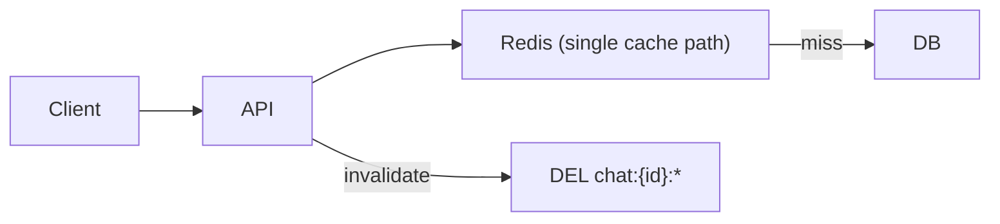
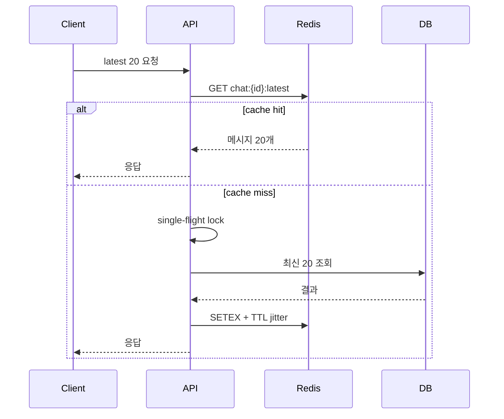

# 채팅 이력 성능 개선 시나리오 (포트폴리오용)

## 1. 문서 목적
이 문서는 AI 채팅 서비스의 이력 조회 성능 개선 과정을 포트폴리오 시나리오로 정리한다.
핵심은 단일 튜닝이 아니라, 문제를 재현하고 원인을 분리한 뒤 단계적으로 개선해 정량 지표로 증명하는 것이다.

## 2. 서비스 특성
- 최근 대화 20개 조회가 가장 빈번하다. (Hot Path)
- 과거 이력 조회는 무한 스크롤 방식이며 우선 100개 범위를 캐싱한다. (Cold Path)
- 메시지는 지속적으로 추가되는 append-heavy 패턴이다.
- 저장소 조회 비용이 요청 수와 강하게 연동된다. (MongoDB 또는 DynamoDB 중 하나로 고정해 설명)

## 3. 성능 목표와 평가 지표
### 3.1 최종 목표
- 최근 20개 조회 요청의 대부분을 캐시 hit로 처리
- 무한 스크롤 구간에서 cache miss를 안정적으로 통제
- 피크 트래픽에서도 P99 급등을 방지
- 저장소 read 요청량/비용 절감

### 3.2 필수 지표 (전/후 비교)
- API latency: P50, P95, P99
- Cache efficiency: latest hit ratio, history hit ratio
- Storage load: reads/request, burst 구간 read spike
- Redis health: CPU, ops/sec, keyspace hit/miss, evicted_keys, slowlog count
- Cost proxy: 10k 요청당 read 비용

## 4. 기준 아키텍처 (문제 상태)
초기 설계는 구현이 쉬웠지만, 트래픽이 늘자 병목이 드러났다.

- 최신/과거 조회를 동일 경로로 처리
- offset 기반 페이지 캐시
- 수정/삭제 시 광범위 `DEL` 기반 무효화
- 일부 요청에서 전체 범위 조회성 접근 (`LRANGE 0 -1`)
- 캐시 키 설계가 coarse-grained여서 작은 변경에도 넓은 범위 invalidate

## 5. 통합 개선 시나리오 (권장 본선 스토리)
### 5.1 1단계: O(n)/Offset/DEL 기반 초기 설계
- 장애 재현이 가능한 최소 구현으로 시작
- 설계상 취약 지점(전체 조회, offset drift, 동기 무효화)을 명시

### 5.2 2단계: 피크 트래픽 장애 재현 (`k6`)
- 시나리오 A: 최근 20개 집중 조회
- 시나리오 B: 무한 스크롤 + 신규 메시지 동시 유입
- 시나리오 C: 동일 TTL 만료 타이밍에서 burst

재현 조건 고정:
- 동일 데이터셋, 동일 VU/Duration, 동일 warm-up
- 실험은 최소 3회 반복, 중앙값 기준 비교

### 5.3 3단계: 원인 분리
- 데이터 구조 문제: 전체 범위 접근으로 `O(n)` 비용 증가
- RTT 문제: 요청당 Redis 명령 왕복 과다
- 무효화 문제: `DEL` 집중 시점 지연 스파이크
- 직렬화 문제: 과대 payload로 애플리케이션 CPU 상승

### 5.4 4단계: 순차 개선
#### 개선 1) 조회 경로 분리
- `chat:{conversationId}:latest`에 최근 20개 고정 캐시
- 과거는 `chat:{conversationId}:before:{cursor}` 기반 페이지 캐시

#### 개선 2) 페이지 전략 전환
- offset -> cursor 전환
- 무한 스크롤 페이지 안정성 확보 (append 시 기존 페이지 재사용률 증가)

#### 개선 3) 무효화 전략 전환
- `v{version}` 키 도입
- 수정/삭제 시 version 증가로 무효화
- 기존 키는 TTL 만료로 자연 정리

#### 개선 4) stampede 방지
- TTL jitter
- single-flight (동일 키 miss 동시 요청 1회 DB 조회)
- stale-while-revalidate

#### 개선 5) 직렬화/응답 경량화
- latest 캐시는 경량 DTO로 구성
- history 페이지는 필요한 필드만 제공

### 5.5 5단계: 전/후 비교
같은 부하에서 아래를 전/후로 제시한다.

- `P95/P99` 지연
- latest/history hit ratio
- reads/request
- Redis CPU 및 slowlog 건수
- 10k 요청당 read cost

## 6. 다중 시나리오 버전 (_1 ~ _6)
통합 시나리오 외에, 면접/리뷰 상황에 따라 아래 서브 시나리오를 독립 제시할 수 있다.

### _1. Hot Path 분리 시나리오
- 포인트: 최근 20개 전용 캐시만으로도 체감 성능을 크게 올릴 수 있음
- 핵심 지표: latest hit ratio, P95

### _2. 무한 스크롤 안정화 시나리오
- 포인트: cursor 전환으로 페이지 drift 제거
- 핵심 지표: history hit ratio, reads/request

### _3. Stampede 억제 시나리오
- 포인트: 피크 구간 tail latency 붕괴 방지
- 핵심 지표: P99, burst 구간 DB read spike

### _4. 무효화 안정성 시나리오
- 포인트: `DEL` 중심 운영에서 versioning 중심 운영으로 전환
- 핵심 지표: invalidate 시점 timeout 비율, latency spike

### _5. 직렬화 비용 절감 시나리오
- 포인트: Redis는 빨라도 앱 CPU가 병목이 될 수 있음을 증명
- 핵심 지표: app CPU, response bytes, P95

### _6. 명령 왕복 최적화 시나리오
- 포인트: pipeline/MGET/Lua로 RTT 축소
- 핵심 지표: ops/sec 대비 latency, 요청당 Redis 명령 수

## 7. 실험 설계 템플릿 (포트폴리오 그대로 사용 가능)
### 7.1 부하 시나리오 예시 (`k6`)
- 워크로드 비율
- latest 조회 70%
- history 조회 20%
- 새 메시지 생성 10%

단계별 부하:
- warm-up: 2분
- steady: 10분
- peak: 5분 (2x~3x)
- cool-down: 2분

### 7.2 관측 수집
- API: p50/p95/p99, error rate
- Redis: `INFO`, `SLOWLOG GET`, `latency doctor`
- 저장소: read metrics, throttle/retry
- 인프라: CPU/memory/network

### 7.3 시각화 권장
- Grafana 대시보드 1장: 전/후 오버레이
- `k6` 결과 요약 1장: 요청량 대비 latency
- Redis slowlog 캡처 1장: 병목 명령 전/후

## 8. 전/후 결과 표 템플릿
아래 표는 실제 실험 결과로 채워 제출한다.

| 지표 | 개선 전 | 개선 후 | 개선율 |
|---|---:|---:|---:|
| P95 Latency (ms) | TBD | TBD | TBD |
| P99 Latency (ms) | TBD | TBD | TBD |
| Latest Hit Ratio (%) | TBD | TBD | TBD |
| History Hit Ratio (%) | TBD | TBD | TBD |
| Reads per Request | TBD | TBD | TBD |
| Redis CPU (%) | TBD | TBD | TBD |
| 10k 요청당 Read Cost | TBD | TBD | TBD |

## 9. 안티패턴 (면접에서 어필 가능한 포인트)
- `KEYS` 기반 무효화를 요청 경로에서 사용
- `LRANGE 0 -1`/`HGETALL` 같은 전체 범위 조회를 빈번 호출
- offset 페이지 캐시를 append-heavy 채팅에 적용
- TTL 없는 무한 캐시
- 대화 전체를 단일 JSON으로 저장하고 매번 전체 갱신

## 10. 구현 메모 (실제 적용 권장값)
- latest 캐시: 20개, TTL 1~5분 + jitter
- history 캐시: 페이지 20~30개 단위, 총 100개 범위, TTL 5~15분
- 쓰기 시: `LPUSH + LTRIM` 중심, 과거 페이지는 비침투
- 수정/삭제 시: version up

## 11. 리스크와 보완
- 캐시 일관성: 완전 강일관성 대신 사용자 체감 우선 (짧은 eventual window 허용)
- 장애 전파: Redis 장애 시 fallback 경로의 보호장치(rate limit, circuit breaker) 필요
- 비용 해석: read cost 절감은 트래픽 분포와 TTL 정책에 따라 변동 가능

## 12. 결론
이 시나리오는 "O(n) 제거" 단일 개선이 아니라, 조회 패턴 분리/무효화 안정화/피크 방어/직렬화 최적화를 묶어 실제 운영에서 의미 있는 성능과 비용 개선을 증명하는 구조다.
포트폴리오에서는 전/후 지표를 같은 부하 조건으로 제시해 재현성과 설득력을 확보한다.
